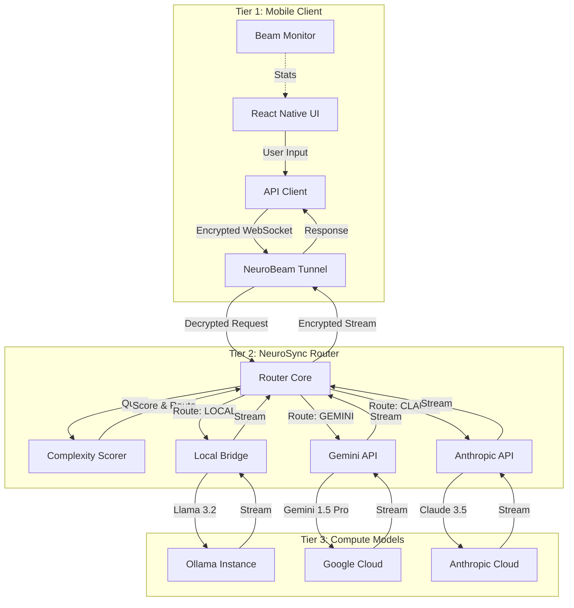

# 1. System Overview & Architecture

## 1.1 Introduction
**NeuroSync** is a distributed, privacy-focused AI orchestration system designed to operate across a heterogeneous network of devices. It implements a **3-Tier Architecture** to balance latency, privacy, and computational power, ensuring that AI requests are handled by the most appropriate node—whether that be a local mobile chip, a personal server, or a cloud cluster.

The system is built on a Cyberpunk/Industrial aesthetic ("The Machine Spirit"), reflected in both the UI and the internal nomenclature (`HADRON`, `SPARK`, `VORTEX`).

## 1.2 High-Level Architecture (The 3 Tiers)

The system divides responsibilities into three distinct tiers:

| Tier | Name | Component | Responsibility | Latency | Privacy |
|------|------|-----------|----------------|---------|---------|
| **1** | **Spark** | Mobile App | UI, Input/Output, Lightweight Logic, Device Control (Battery/Haptics) | Ultra-Low | High (Local) |
| **2** | **Vortex** | Router | Routing Decision, Context Management, Complexity Scoring, P2P Tunneling | Low | High (Self-Hosted) |
| **3** | **Core/Hadron** | Compute | Heavy Inference (LLMs), Code Generation, Deep Research | Variable | Variable (Local/Cloud) |

### 1.2.1 Tier 1: The Mobile Client (Exo-Cortex)
* **Stack**: React Native (Expo SDK 54), NativeWind v4, TypeScript.
* **Role**: Acts as the sensory organ of the system. It captures user intent (text, voice, image), monitors device state (battery, network), and presents the AI's response.
* **Key Feature**: **NeuroBeam Client**. The app includes a custom implementation of an encrypted WebSocket client to securely tunnel into the user's private network without relying on third-party cloud relays.

### 1.2.2 Tier 2: The Router (The 4th Ventricle)
* **Stack**: Python 3.11, FastAPI, Uvicorn.
* **Role**: The "Brain Stem" of the operation. It does not "think" deeply; it decides *who* should think.
* **Logic**:
    1.  Receives request from Tier 1.
    2.  `ComplexityScorer` evaluates the query (Token count, Code keywords, Research markers).
    3.  Determines the optimal route: `LOCAL` (Privacy/Speed), `GEMINI` (Multimodal), `CLAUDE` (Coding).
    4.  Selects the appropriate System Persona (`HADRON`, `SPARK`, etc.).
    5.  Streams the response back to Tier 1.

### 1.2.3 Tier 3: The Heavy Compute (The Omnissiah)
* **Stack**: Ollama (Local), Google Gemini Pro, Anthropic Claude 3.5 Sonnet.
* **Role**: Pure cognitive horsepower.
* **Configuration**:
    *   **Local**: Uses `llama3.2` or `mistral` via Ollama for offline/private tasks.
    *   **Cloud**: Offloads to Gemini/Claude when local resources are insufficient or distinct capabilities (vision, huge context) are required.

---

## 1.3 System Diagram

---

## 1.4 NeuroBeam: The P2P Protocol

The system relies on **NeuroBeam**, a custom P2P tunneling protocol designed to punch through NATs and firewalls without configuration.

*   **Encryption**: AES-256-GCM.
*   **Handshake**: QR-code based key exchange (Session ID + 256-bit Key).
*   **Transport**: WebSockets over HTTP/1.1.
*   **Philosophy**: "Trust No Relay". The mobile app talks directly to the Python bridge, ensuring that even if the traffic passes through a public network, the payload remains opaque.

*(See Document 03 for full Protocol Specification)*
